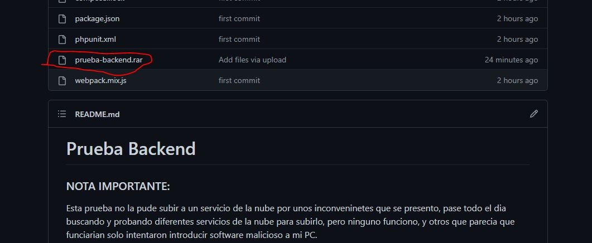

# Prueba Backend

### NOTA IMPORTANTE:
Esta prueba no la pude subir a un servicio de la nube por unos inconvenientes que se presentó, pase todo el día buscando y probando diferentes servicios de la nube para subirlo, pero ninguno funciono, y otros que parecía que funciarian solo intentaron introducir software malicioso a mi PC.

Por esa razón de tanto intentar y no poder encontrar uno que me permitirá subirlo, decidí mejor subir un archivo .rar a este repositorio, este es el documento:


<p align="center">

</p>
Espero que puedan comprender la situación, gracias de antemano.

---

# Herramientas para desplegar el proyecto.
- Xampp v3.3.0
- Editor de codigo (en mi caso VS)
- Composer
# Base de datos
- En el archivo (.env) la base de datos que se utilizo fue (MySQL)
- Nombre de la Base de Datos <  prueba_backend  >

# Comandos a Ejecutar
- Una vez creada la base de datos y configurado sus parámetros en el archivo (.env), ejecutar el siguiente comando dentro del proyecto.
- . ``` php artisan migrate --seed ```

- Podemos probar el proyecto en la siguiente ruta si tiene instalado Xampp (http://localhost/prueba-backend/public/)
